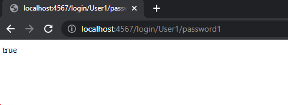
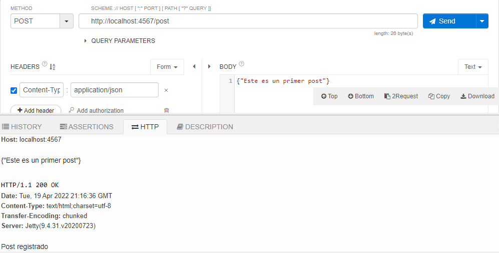
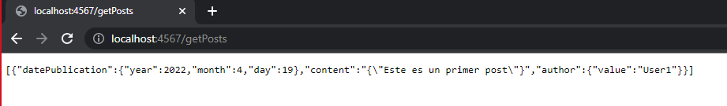

# MONOLITO - API Twitter

En este proyecto se realiza una versión de un prototipo de aplicación similar a twitter donde
un usuario que debe previamente loguearse, puede ingresar nuevos posts al hilo principal. 

## Cómo empezar

A continuación podrá encontrar los pasos con los cuales puede acceder al sitio web o usar el proyecto de manera local.

### Prerrequisitos

* [Maven](https://maven.apache.org/) - Administrador de dependencias
* [Java ](https://www.oracle.com/co/java/technologies/javase/javase-jdk8-downloads.html)       Ambiente de desarrollo
* [Git](https://git-scm.com/) - Sistema de control de versiones

### Pruebas

Verificamos que el usuario ingresado exista y pueda realizar el login con usuario y contraseña dados.

Verificamos que sea posible agregar un nuevo post

Validamos los post guardados hasta ahora

## Construido con

* [Maven](https://maven.apache.org/) - Administrador de dependencias
* [Spark](http://sparkjava.com) - Framework para desarrollo de aplicaciones web

## Autores

**Camilo Andrés Pichimata Cárdenas**

**Zuly Valentina Vargas Ramírez**

## Licencia

Este proyecto esta bajo la licencia GNU(General Public License) los detalles se encuentran en el archivo [LICENSE](LICENSE.txt).
